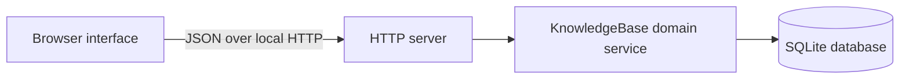

# Architecture

## Runtime shape

The project is a dependency-free Node.js application. One process serves the browser client, exposes the JSON API, applies domain rules, and persists data in SQLite.

The default listener is `127.0.0.1:3000`, so the application is local-only unless the operator explicitly changes `HOST`.

## Boundaries

### Browser interface

`public/index.html`, `public/styles.css`, `public/app.js`, and `public/inline-terms.js` render the tree and operate entirely through the JSON API. The client guides valid entry but is not trusted to enforce integrity.

User-authored names, understanding statements, description text, term labels, and definitions are inserted with DOM text APIs. They are never rendered as HTML. Explicit term-reference parts become native buttons; a shared accessible popover shows the matching node-local definition and supports click, focus, and Escape-to-close interaction.

### HTTP boundary

`src/server.js` owns routing, JSON parsing, response formatting, static files, and process startup. It converts expected domain failures to stable JSON errors. It contains no knowledge-tree policy.

Request bodies are limited to 1 MB except complete knowledge-base imports, which accept up to 50 MB. Unknown routes return JSON `404` responses.

`src/agent-guide.js` is the machine-readable project and agent policy, including the canonical child expansion boundary. `src/agent-tools.js` publishes the five agent operations with endpoints, descriptions, and JSON input schemas. `src/openapi.js` is the authoritative OpenAPI 3.1 request, response, and error contract. The server exposes these through `/api/agent/guide`, `/api/agent/tools`, and `/api/openapi.json`; the domain service remains the authority for validation and writes.

### Domain service

`src/knowledge-base.js` is the sole write path for nodes and connections. It normalizes input and enforces tree invariants before performing SQL operations. Multi-row subtree moves use an immediate transaction.

Agent establishment and update operations use the same immediate transaction for the revision comparison, understanding, description, and term update, and all requested child insertions. Newly created child specifications may contain their own validated descriptions and terms while remaining unassessed leaves. Agent operations never hold navigation state. A revision changes when the node's conceptual fields, placement, or immediate child set changes, so a stale agent view is rejected before any part of its mutation is applied.

Frontier listing is a read-only Subjects query. It joins each unknown or unassessed candidate to its immediate canonical parent and requires that parent to be known. Both rows must belong to Subjects. Results use ascending node IDs and an opaque filter-bound cursor so pagination does not require server-side session state.

### Persistence

`src/database.js` opens SQLite, enables foreign keys and write-ahead logging, and creates the current schema idempotently.

The `nodes` table stores conceptual nodes. A nullable `parent_id` means direct placement under the virtual branch named by `branch`. Structured descriptions and node-owned terms are stored as validated JSON arrays in `description_json` and `terms_json`; the domain layer owns their complete cross-field contract. The `connections` table stores each undirected edge once with the smaller node ID as `source_id`.

Database checks and unique indexes provide a second integrity layer for statuses, explanations, branches, endpoint ordering, and sibling names.

### Versioned transfer

`GET /api/export` produces a portable JSON document with an explicit format name and format version. It contains every persisted node, connection, and application metadata entry while keeping the virtual roots implicit. It is not a raw SQLite file and does not depend on a database filesystem path.

`POST /api/import` accepts only supported export versions. The domain service validates the complete document, including field shapes, identities, sibling uniqueness, canonical parents, branch consistency, known-parent rules, cycles, connection endpoints, and metadata uniqueness before beginning replacement. It then clears and restores the persisted model in one immediate SQLite transaction. Existing data remains intact if validation or application fails.

The browser uses the native save-file picker when available so the user can choose the export folder and filename. Its fallback uses normal browser download behavior. Import requires an explicit whole-database replacement confirmation.

The database opener migrates databases created before agent support by adding `revision` with an initial value of 1. It also migrates nodes created before inline terms by adding empty description and term arrays, preserving all existing node content.

## Initial taxonomy policy

The two primary branches remain virtual constants assembled around stored nodes by `KnowledgeBase.getTree()`. On the first production database open, `src/initial-taxonomy.js` inserts a curated set of broad top-level Subject and Ideology nodes as unassessed leaves. It never inserts an understanding statement or known status.

An `app_metadata` marker makes this a one-time seed. Existing matching nodes are preserved, and a seeded node deleted or reorganized by the user is not recreated on later startups. Tests can explicitly disable the seed to exercise isolated domain scenarios against an empty tree.

Ideologies is treated as the broad philosophy branch. The seed therefore has no Philosophy container and no redundant “Philosophy of …” layer.

## Failure model

Expected failures use an `AppError` with an HTTP status, stable machine-readable code, and user-readable message. Validation errors are `400`; missing resources are `404`; state conflicts such as invalid frontier changes are `409`. Unexpected failures are logged to the local process and returned as a generic `500` response.

## Current trust and deployment boundary

The base application is designed for one user on one local machine. It has no authentication, multi-user isolation, remote deployment hardening, backup scheduler, or encryption layer. Binding it to a non-loopback interface would require a separate security design.
